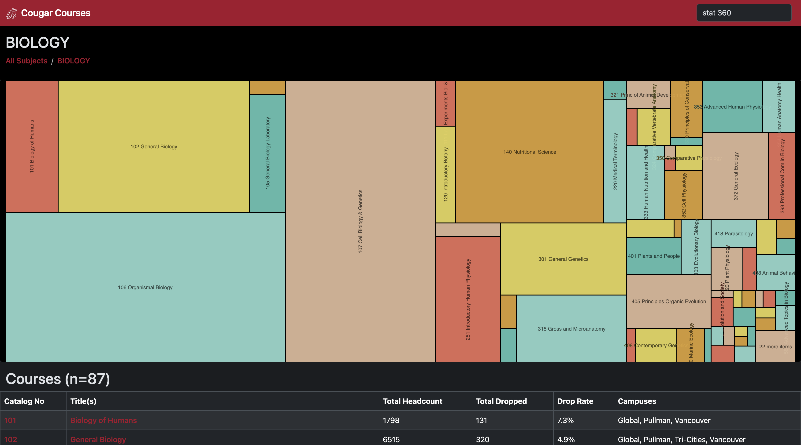

# Coug Courses Frontend

Disclaimer: I wrote this very fast and it's sloppy, non-peer-reviewed code. If you are a practitioner of the software arts please close both of your eyes and run far, far away.

## Screenshots





## Formatting

Do `npx prettier . --write` or just add it to your git hooks:

```
echo -e '#!/bin/bash\nnpx prettier . --write' > .git/hooks/pre-commit && chmod +x .git/hooks/pre-commit
```
